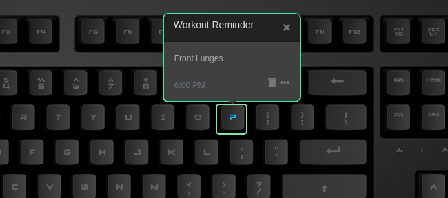

# Pushup Reminder

Do you find yourself sitting at your desk for long periods?
This is an applet for anybody who has ever found it difficult to fit exercise into their busy schedule. The Workout Reminder is a quick, easy, and convenient way to set up reminder notifications that will alert you with blinking key of your choice. Customize your workout schedule by easily choosing exercise that you want to perform from the list of 12.
The applet choses a workout at random or displays all the different exercises you have chosen.

